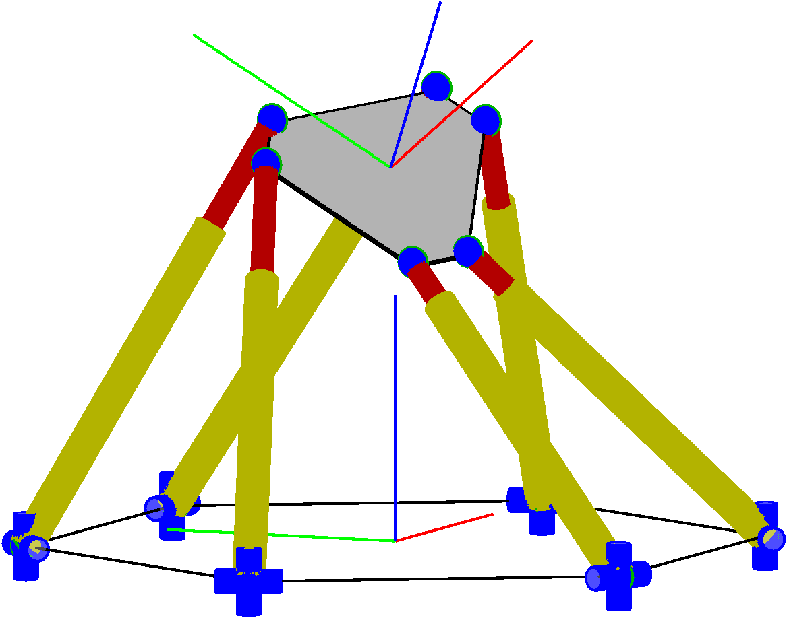
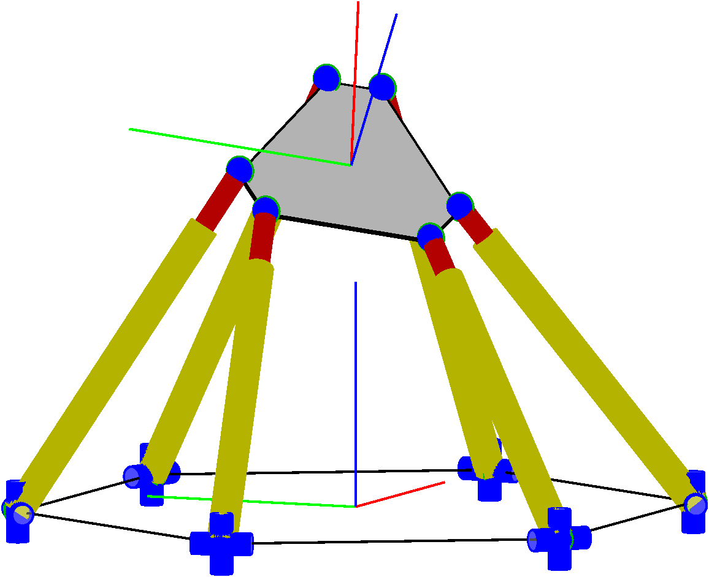
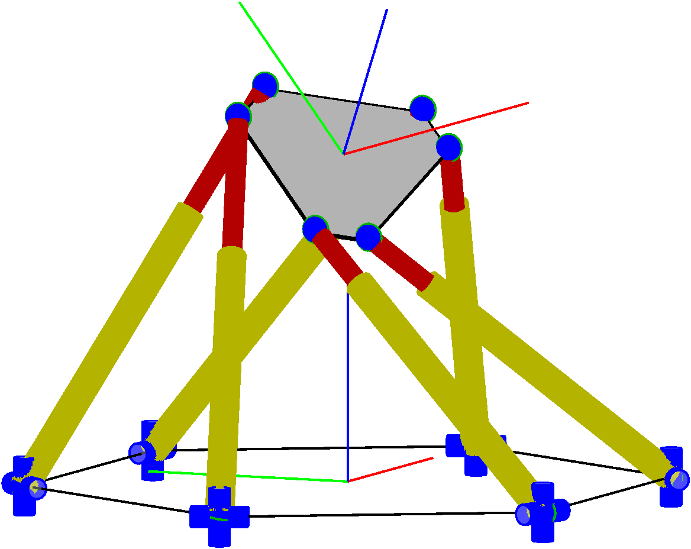

# Singularity Avoidance of Task-Redundant Robots in Pointing Tasks

Authors: Moritz Schappler, and Tobias Ortmaier

This code is supplemental material to the following submission to the [ICINCO Conference](http://www.icinco.org/) 2021:

```bib
@InProceedings{SchapplerOrt2021,
  author    = {Schappler, Moritz and Ortmaier, Tobias},
  booktitle = {Proceedings of the 18th International Conference on Informatics in Control, Automation and Robotics (ICINCO 2021)},
  title     = {Singularity Avoidance of Task-Redundant Robots in Pointing Tasks: On Nullspace Projection and Cardan Angles as Orientation Coordinates},
  year      = {2021},
  doi       = {10.5220/0010621103380349},
}
```

<p align="middle">
  
   
  
</p>
Fig. 2 of the conference paper: example for nullspace motion of a hexapod parallel robot. Left to right: initial poses and final pose.  

The following submission to the Springer LNEE series extends the conference paper:

```bib
@InProceedings{Schappler2022,
  title={Pose Optimization of Task-Redundant Robots in Second-Order Rest-to-Rest Motion with Cascaded Dynamic Programming and Nullspace Projection},
  author={Schappler, Moritz},
  booktitle={International Conference on Informatics in Control, Automation and Robotics},
  note={submitted for publication},
  year={2022},
  organization={Springer}
}
```

<p align="middle">
  
   
  
</p>
Fig. 12 of the LNEE paper: different poses of the parallel robot in the example trajectory.

## Contents and Useage

This repository contains Matlab scripts and Latex code to reproduce results and statements of the papers. Beforehand, the steps from the [prerequesites section](#prerequisites) have to be performed.

### Replicate Results

Each section of the papers can be reproduced by a Matlab script.

ICINCO Conference paper:

* Sec. 3 (serial-link robot modeling regarding nullspace motion in pointing task)
  * `proof/SerRob_nullspace_proof.m`
* Sec. 4 (parallel robot modeling regarding nullspace motion in pointing task)
  * `proof/ParRob_nullspace_proof.m`
* Sec. 5 (aspects of control loop design for nullspace motion generation)
  * `proof/statement_stability_I2_P_controlled.m` (one statement regarding stability of P controller in the linear case)
* Sec. 6 (simulation results for the nullspace motion, this also creates the figures of the section)
  * `case_study/ParRob_nullspace_static_pose.m` (nullspace motion simulation of Sec. 6.1, without task trajectory).
  * `case_study/ParRob_nullspace_trajectory.m` (simulation of Sec. 6.2, with task trajectory).

LNEE book series paper:

* Sec. 4 (dynamic programming example)
  * First the DP algorithm has to be run with `case_study/ParRob_dynprog.m` from below
  * `paper_LNEE/figures/fig_dynprog_discr_example.m` (creates Figures 3 and 4 in Sect. 4.1)
  * `paper_LNEE/figures/fig_dynprog_interv_example.m` (creates Figures 5 to 8 in Sect. 4.2 and Fig. 9 and 10 in Sect. 4.3)
* Sec. 5 (robot example for two trajectories)
  * `case_study/ParRob_dynprog.m` (creates Figures 1, 11, 12 and 13

All SVG figures are created with InkScape.

## Prerequisites <a name="prerequisites">

For the Matlab scripts to work, the following steps have to be performed:

1. Install Matlab (tested with R2021a)
2. Set up the Matlab mex compiler, if not already done
3. Download Matlab dependencies:
    * [Toolbox for geometry functions](https://github.com/SchapplM/robotics-dep-geometry) (tested with rev. c4af53d; 2021-10-26)
    * [Toolbox for trajectory functions](https://github.com/SchapplM/robotics-dep-traj) (tested with rev. 42c8302; 2022-02-09)
    * [Collection of external dependencies](https://github.com/SchapplM/robotics-dep-ext) (tested with rev. 22ebc7b; 2022-01-24)
    * [Toolbox for various Matlab functions](https://github.com/SchapplM/matlab_toolbox) (tested with rev. 75042a9; 2022-03-05)
    * [Robotics toolbox](https://github.com/SchapplM/robotics-toolbox) (tested with rev. bf1fa8c; 2022-03-06)
    * [Serial robot model database](https://github.com/SchapplM/robsynth-serroblib) (tested with rev. 4eea00a57; 2022-02-04)
    * [Parallel robot model database](https://github.com/SchapplM/robsynth-parroblib) (tested with rev. 63bb260; 2022-02-05)
    * Update the repositories to the given versions. If the master branch is on an older version, change of branch is required. You should first try the more recent version before downgrading to the given versions. It should still work.
    * Short command to download all repositories (run in Git Bash in Windows or in Linux terminal):
      ```Bash
      git clone git@github.com:SchapplM/robotics-dep-geometry.git -b dev
      git clone git@github.com:SchapplM/robotics-dep-traj.git -b dev
      git clone git@github.com:SchapplM/robotics-dep-ext.git -b dev
      git clone git@github.com:SchapplM/matlab_toolbox.git -b dev
      git clone git@github.com:SchapplM/robotics-toolbox.git -b nullspace_rest
      git clone git@github.com:SchapplM/robsynth-serroblib.git -b dev
      git clone git@github.com:SchapplM/robsynth-parroblib.git -b dev
      ```
4. Run the path initialization scripts (`..._path_init.m`) of all downloaded software repos in Matlab. Put the run commands in the startup.m file of Matlab if used frequently.

